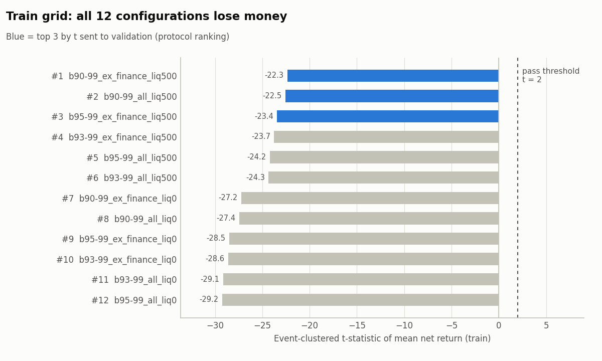
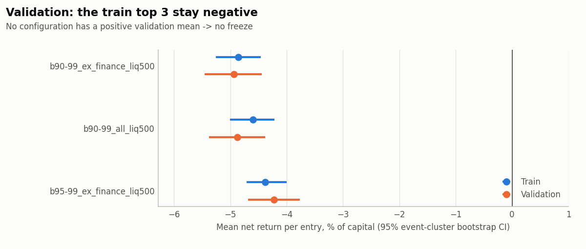
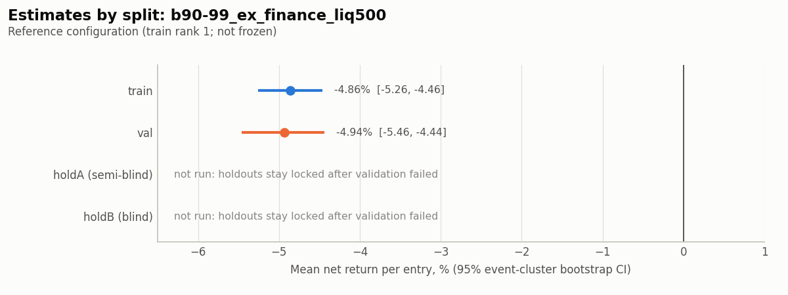
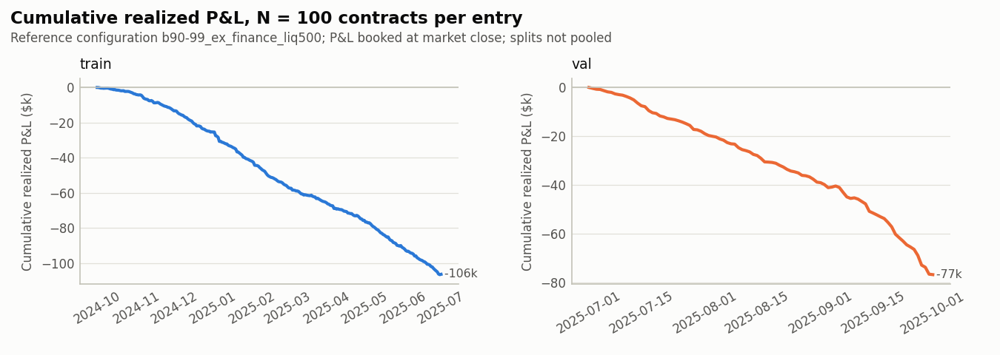
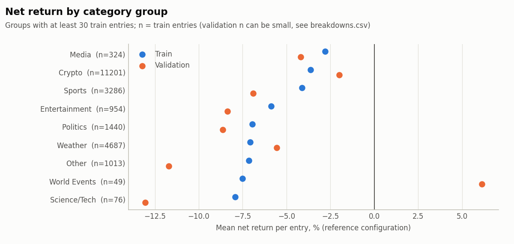

# Longshot-bias fading test: report

**Verdict: Not supported (failed validation).**

All 12 pre-registered configurations lose money on train. The three best-ranked configurations also lose money on validation, so the selection rule selects nothing. As the protocol requires, there was no freeze, and neither holdout was unlocked or examined.

Every number below comes from a committed file in `research/longshot_fade/results/`, named next to the number.

---

## 1. Question and hypothesis

**Question.** Becker (2026) finds that on Kalshi, from 2024 Q4 onward, liquidity takers lose to makers, and that YES positions do worse than NO positions at the same cost basis. The gap is largest at longshot prices. Can a trader who only *takes* liquidity profit from that by buying NO against overpriced longshot YES, after taker fees, on data not used to choose the strategy?

**H1** (pre-registered, `PROTOCOL.md` §6). On Kalshi, a liquidity taker who buys NO at a cost basis inside the frozen band (within 90–99¢, i.e. against YES at 1–10¢) and holds to resolution earns a positive mean return per dollar at risk, net of taker fees.

**Design.**
- 12 configurations: NO-cost band {90–99, 93–99, 95–99}¢ × category filter {all, ex-Finance} × liquidity floor {$0, $500 prior notional}.
- Entry: one per market, at the first taker-NO print that qualifies, with N = 100 contracts, held to resolution.
- Inference: event-clustered t, plus a 1,000-draw event-cluster bootstrap with seed 20251001.
- Selection: train top 3 by t → validation, keeping only configurations with a positive validation mean.
- Confirmation: holdout A (semi-blind) and holdout B (blind).

## 2. Data and splits

- **Source.** Local Kalshi trades and markets (`docs/SCHEMAS.md`): 72.1M trades up to 2025-11-25 22:00 UTC, and a markets snapshot taken 2025-11-23/24.
- **Panel.** Two rows per trade (taker and maker), built one quarter at a time (`results/panel_manifest.json`):

| Split | Window (UTC) | Trades | Events | Events purged to a later split |
|---|---|---|---|---|
| train | 2024-10-01 → 2025-07-01 | 18,076,641 | 23,485 | 1,451 |
| val | 2025-07-01 → 2025-10-01 | 17,218,565 | 16,797 | 2,185 |
| holdA (semi-blind) | 2025-10-01 → 2025-11-25 | 32,634,469 | 162,087 | 0 |
| holdB (blind) | live API window after freeze | not pulled | — | — |

- **Purge rule.** Each event is kept only in the latest split where it trades (`results/purge_summary.json`).
- **Unmapped categories.** Events whose category could not be mapped make up 2.25% of panel rows; they are grouped as "Other".
- **HoldA hash.** The holdA panel file's SHA-256 was recorded at build time: `4ed917c8…b3499a`.
- **Why holdA is only semi-blind:** Becker's published results use data through 2025-11-25, so the hypothesis was shaped by findings that include that window. HoldB, fresh API data pulled after a freeze, was meant to be the blind test. Validation failed, so it was never pulled.
- **Price normalization.** 267,291 holdA trades have sub-cent or truncated prices. The registered rule assigns them a cost that never understates what was paid. These trades all fall in holdA, which was never used.

## 3. Design and pre-registration trail

| Step | Commit | UTC | Content |
|---|---|---|---|
| Protocol (tag [`protocol-v1`](https://github.com/m-armski01/JBecker-prediction-market-analysis/tree/protocol-v1)) | [`8dfc6af`](https://github.com/m-armski01/JBecker-prediction-market-analysis/commit/8dfc6af0e0cc2f217238a1021d9dfbe33d18ad44) | 2026-10-05 16:58:37 | Hypothesis, estimator, decision rule, selection, verdict table, fee verification, `close_time` audit |
| Panel and tests | [`a361fae`](https://github.com/m-armski01/JBecker-prediction-market-analysis/commit/a361fae1f021500105b7e89e06e69c57ee6377a0) | 2026-10-05 17:15:36 | Positions table, fee model, statistics, unlock guard, holdB puller, unit tests, manifest, sanity check |
| Train grid | [`c900d0c`](https://github.com/m-armski01/JBecker-prediction-market-analysis/commit/c900d0c5b47e479cc3661f1be13936b31af74e6a) | 2026-10-05 17:16:55 | `results/train_grid.csv` |
| Validation | [`e9bcead`](https://github.com/m-armski01/JBecker-prediction-market-analysis/commit/e9bceadc32d5fb4e7440f3003a2d17cdba5f7d91) | 2026-10-05 17:17:30 | `results/val_top3.csv`, `results/val_selection.json`: no configuration qualifies |
| Freeze, holdout A, holdout B | — | — | **Not run.** The protocol skips them after validation fails, so no `prereg-frozen`, `holdout-a-run` or `holdout-b-run` tag exists. `HOLDOUT_LOG.md` has no entries. |

Before registration, only non-outcome data checks and the train-only `close_time` audit were run (`PROTOCOL.md` Appendices B and C). Every departure from the spec is in `DEVIATIONS.md` (D1–D18).

## 4. Results

### 4.1 Sanity check: Becker's sign replicates on train

Per position, the mean maker `gross_ret` is +0.0370 and the mean taker `gross_ret` is −0.0863. That is a gap of **+0.1233** (17,127,820 positions per role), so the check passes (`results/sanity_train.json`).

At equal cost basis, YES positions do worse than NO positions in 74% of cost levels, by −4.9 percentage points of gross return on a weighted average (`results/becker_replication_train.json`, `results/becker_yes_no_by_cost_train.csv`).

### 4.2 Train: all 12 configurations lose money

From `results/train_grid.csv`:

| Rank | Configuration | Entries | Events | Mean net ret | Mean gross ret | t (event) | 95% boot CI | Win rate | Bonferroni p |
|---|---|---|---|---|---|---|---|---|---|
| 1 | b90-99_ex_finance_liq500 | 23,030 | 10,699 | −4.86% | −4.40% | −22.33 | [−5.26%, −4.46%] | 89.0% | 1 |
| 2 | b90-99_all_liq500 | 26,176 | 12,059 | −4.60% | −4.17% | −22.54 | [−5.01%, −4.22%] | 89.3% | 1 |
| 3 | b95-99_ex_finance_liq500 | 20,830 | 10,046 | −4.38% | −4.14% | −23.43 | [−4.71%, −4.00%] | 92.5% | 1 |
| 4 | b93-99_ex_finance_liq500 | 21,768 | 10,325 | −4.73% | −4.42% | −23.74 | [−5.12%, −4.35%] | 91.1% | 1 |
| 5 | b95-99_all_liq500 | 23,405 | 11,253 | −4.26% | −4.03% | −24.19 | [−4.60%, −3.95%] | 92.6% | 1 |
| 6 | b93-99_all_liq500 | 24,586 | 11,599 | −4.56% | −4.25% | −24.34 | [−4.89%, −4.21%] | 91.2% | 1 |
| 7 | b90-99_ex_finance_liq0 | 51,798 | 15,802 | −3.87% | −3.48% | −27.22 | [−4.15%, −3.61%] | 91.0% | 1 |
| 8 | b90-99_all_liq0 | 59,680 | 17,730 | −3.68% | −3.31% | −27.42 | [−3.95%, −3.42%] | 91.1% | 1 |
| 9 | b95-99_ex_finance_liq0 | 45,015 | 14,607 | −3.51% | −3.30% | −28.50 | [−3.75%, −3.25%] | 93.7% | 1 |
| 10 | b93-99_ex_finance_liq0 | 47,978 | 15,140 | −3.75% | −3.47% | −28.62 | [−3.99%, −3.50%] | 92.6% | 1 |
| 11 | b93-99_all_liq0 | 54,850 | 17,008 | −3.59% | −3.33% | −29.13 | [−3.83%, −3.36%] | 92.7% | 1 |
| 12 | b95-99_all_liq0 | 51,057 | 16,395 | −3.42% | −3.22% | −29.25 | [−3.65%, −3.18%] | 93.8% | 1 |

- Every configuration has a mean net return between −3.4% and −4.9% per dollar at risk, and every bootstrap CI lies entirely below zero.
- The pre-registered ranking orders configurations by t. Since every t is negative, the top 3 are the configurations with the *least* negative t. Those happen to be the smaller-sample liquidity-floor variants, not the ones with the least negative mean.
- **Independent cross-check.** `b95-99_all_liq0` was recomputed directly from the raw trade and market files, bypassing the panel. It finds the same 51,062 candidate entries and the same 51,040 settled entries, with a mean gross return of −3.220% on settled entries. The panel gives −3.219% once its 17 void entries are included at zero (`results/crosscheck_train_raw.json`). The negative result is not a panel artefact.
- Censoring is negligible: at most 7 entries per configuration.

### 4.3 Validation: no configuration qualifies

From `results/val_top3.csv` and `results/val_selection.json`:

| Train rank | Configuration | Entries | Events | Mean net ret | t (event) | 95% boot CI | Qualifies (mean > 0) |
|---|---|---|---|---|---|---|---|
| 1 | b90-99_ex_finance_liq500 | 16,351 | 8,931 | −4.94% | −19.14 | [−5.46%, −4.44%] | no |
| 2 | b90-99_all_liq500 | 17,784 | 9,666 | −4.88% | −19.63 | [−5.38%, −4.38%] | no |
| 3 | b95-99_ex_finance_liq500 | 14,679 | 8,508 | −4.23% | −18.48 | [−4.69%, −3.77%] | no |

The selection rule (keep validation `mean_net_ret > 0`, choose the highest validation t) selects nothing. **The verdict is therefore "Not supported (failed validation)".**

### 4.4 Holdouts

**Not run.**
- holdA's outcome data were never read.
- holdB was never pulled.
- `unlock.py`, `freeze.py` and `holdout_b.py` exist and are unit-tested, but they were never executed against data.

### 4.5 Verdict

| holdA | holdB | Verdict |
|---|---|---|
| (validation failed) | (not run) | **Not supported (failed validation)** |

## 5. Economic magnitude against fees

**Reference configuration.** The figures in this section use `b90-99_ex_finance_liq500`, the train rank-1 configuration. It is **not frozen**: no configuration was frozen (DEVIATIONS D18). Sources: `results/backtest_portfolio.json`, `results/sensitivities.csv`.

| Metric | Train | Val |
|---|---|---|
| Mean fee, % of capital (N = 100) | 0.47% | 0.48% |
| Mean gross ret → mean net ret | −4.40% → −4.86% | −4.47% → −4.94% |
| Return per capital-day (Σ P&L / Σ cost × days) | −1.02% | −5.58% |
| Realized P&L (N = 100 per entry) | −$106,353 | −$76,802 |
| Peak capital in use | $94,071 | $25,884 |
| Return on peak capital | −113% | −297% |
| Max drawdown of realized P&L | $106,613 | $76,890 |
| Worst event | KXSHIBAD-25MAY2117, −$946 | KXTRUMPMENTION-25SEP02, −$607 |
| Largest event's share of gross absolute P&L | 0.32% | 0.27% |

- **Fees are not what makes the strategy fail.** They cost about 0.5% of capital, but the loss *before* fees is already about 4.4%. With zero fees, the strategy would still lose more than 4% per dollar at risk.
- **Break-even.** The average entry is 93.2¢. Including fees, an entry breaks even only if NO wins 93.7% of the time on train (93.6% on val). NO actually wins 89.0% of the time on train and 88.8% on val (`results/backtest_portfolio.json`).

The losses are steady and spread out. The cumulative P&L falls almost linearly in both splits, and no single event accounts for more than 0.32% of gross absolute P&L.

### Sensitivities

Each row changes one thing relative to the reference configuration at N = 100 (`results/sensitivities.csv`):

| Variant | Train mean net | Train t | Val mean net | Val t |
|---|---|---|---|---|
| Base (N = 100) | −4.86% | −22.33 | −4.94% | −19.14 |
| N = 10 | −4.92% | −22.59 | −4.99% | −19.36 |
| N = 1000 | −4.86% | −22.32 | −4.93% | −19.13 |
| +1¢ slippage | −5.81% | −26.95 | −5.88% | −23.04 |
| Second qualifying print | −3.18% | −15.42 | −2.95% | −12.07 |
| Size capped at min(N, print count) | −4.93% | −22.67 | −5.01% | −19.45 |
| Excluding void markets | −4.86% | −22.33 | −4.94% | −19.14 |

None of the variants comes close to zero.

### Breakdowns

From `results/breakdowns.csv`:
- **By price bucket.** Losses grow with price: 90–92¢ −3.07%, 93–94¢ −5.15%, 95–96¢ −6.07%, 97–99¢ −8.24% (train). Validation shows the same ordering.
- **By group.** Every group with at least 30 train entries is negative in both splits. The one exception is World Events in validation, with only 5 entries.

**Why the strategy loses even though Becker's YES < NO gap exists.** Taken over every taker-NO print at 90–99¢ on train, buying NO is roughly fairly priced: mean gross return is −0.43% across 1,382,809 prints (`results/becker_replication_train.json`). The rule "first qualifying print per market" picks prints that do much worse (−4.4% gross for the reference configuration). Entering at the *second* qualifying print instead still loses 3.2% net. The optimism tax Becker measures accrues mainly to *makers*, and the strategy is a taker strategy.

## 6. Objections

- **Staleness and executability of prints.** Entries use trade prints, not quotes. A print shows that someone bought NO at that price, not that 100 more contracts were available. Capping size at the print count leaves the loss unchanged (−4.93% train). One cent of slippage makes it worse (−5.81%). Neither change can turn the sign positive.
- **Timing of the first print.** Prints that come more than 24 hours after a market opens lose the most: −6.0% train, −7.2% val. Prints in the first hour lose the least: −3.5% train, −2.0% val (`results/breakdowns.csv`). Waiting for later prints does not rescue the strategy either (second-print sensitivity above).
- **Composition shift toward sports.** Sports make up 42% of validation entries (6,932 of 16,351) against 14% on train (3,286 of 23,030). Sports lose −6.9% in validation; crypto improves to −2.0%. All the major groups are negative in both splits, so the result does not hinge on the mix.
- **Censoring.** Only 2 train entries and 1 validation entry of the reference configuration were unresolved and excluded. Censoring cannot explain the result.
- **`close_time`.** For finalized markets, `close_time` is the actual close, which is earlier than scheduled when a market closes early (`PROTOCOL.md` Appendix B). It is used only for `hold_days`, which drives the per-capital-day and portfolio-timing figures. It plays no part in the verdict.
- **Fee assumptions.** S&P 500 and Nasdaq-100 series get the verified half rate. That no other series had an exception in 2024–25 is an assumption. Fees are only about 0.5% of capital against a gross loss of about 4.4%, so no plausible fee error changes the sign.
- **No order-book data.** Without historical depth there is no way to check what the ask was at entry, or what passive (maker) entry would have earned. Maker strategies are out of scope here.

## 7. Limitations and next steps

- **Untouched holdouts.** The holdouts were never examined, so holdA (2025-10-01 → 2025-11-25) and any fresh API window are still available for a new pre-registered test. HoldA remains semi-blind with respect to Becker's paper.
- **Network access.** Kalshi's API was intermittently unreachable from this machine (`DEVIATIONS.md` D12). A future holdB run needs reliable, permitted access.
- **Next step: paper trading against the live order book.** Record top-of-book quotes and depth, and simulate taker fills at the quoted ask. Compare that with resting (maker) NO orders at the same prices. Becker's results and the all-prints figure above point to the maker side as where any edge lives. That would be a different hypothesis, and it should be registered before any of its data are looked at.
- **Mechanism.** The first qualifying print per market loses badly while the average taker-NO print is roughly fair. That suggests adverse selection in *when* a taker first gets filled at a high NO price. Studying it needs quote-level data.
